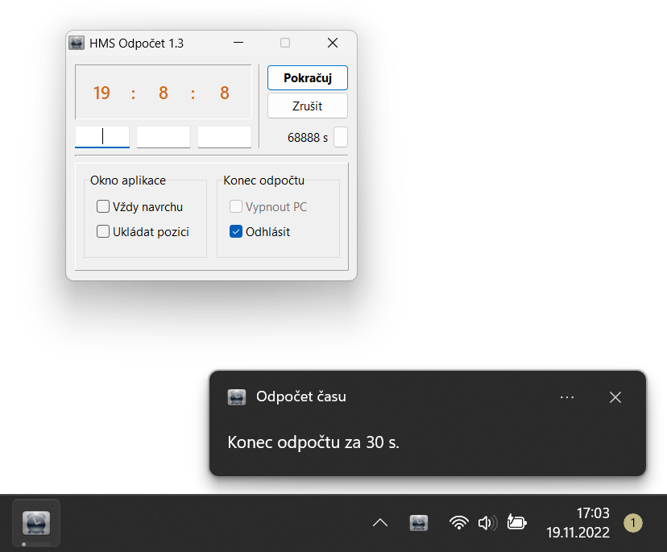

# HMS Odpočet

> Utilita na odpočet času a vypnutí PC

### Funkce:

- odpočet času, pozastavení odpočtu
- vypnutí PC nebo odhlášení uživatele
- zobrazení okna aplikace vždy v popředí
- přichytávání k rohům obrazovky,
- znázornění odpočtu progress barem na hlavním panelu
- minimalizace do tray ikony (levým klikem na tuto ikonku)
- systémová oznámení:
  - 60 s před vypnutím/odhlášením (zvukový alert 5 s před koncem),
  - 30 s před koncem odpočtu,
  - na konci odpočtu

### Ke stažení:

**Kompatibilita:** Windows XP (SP3) &ndash; Windows 11 (24H2)
- [HMS Odpočet 1.3 (win-x86)](https://github.com/ma-ta/hms-odpocet/releases/download/v1.3.0/HMS_Odpocet_1.3.exe)
- [skript pro spuštění s lepším škálováním](https://github.com/ma-ta/hms-odpocet/releases/download/v1.3.0/HMS_Odpocet_1.3.bat)
  *(skript spustí aplikaci v módu GDI škálování&nbsp;&ndash;&nbsp;obdobně možné ručně přes Vlastnosti souboru&ndash;Kompatibilita: zde High DPI scalling override na System Enhanced)*

### Známé nedostatky:

> **Starý školní projekt v Delphi z roku 2010 (původní zdrojové kódy ztraceny&nbsp;&ndash;&nbsp;viz [info k verzi 1.3](https://github.com/ma-ta/hms-odpocet/tree/main/source/verze%201-3))**

- Aplikace umí ukládat poslední nastavení a pozici okna, ale pouze s právy administrátora (soubor *C:\Windows\hms_odpocet.ini*)
  &nbsp;&ndash;&nbsp;**[patch ve verzi 1.3]**,
- zastarávající GUI (není responzivní &ndash; problém u současných vysokých rozlišení)
  &nbsp;&ndash;&nbsp;**[patch ve verzi 1.3]**,
- maximální nastavitelný čas odpočtu je 23 hodin 59 minut a 59 sekund.

### Screenshoty:

- [Všechny snímky obrazovky](screenshoty/)

Windows 11 (24H2):

