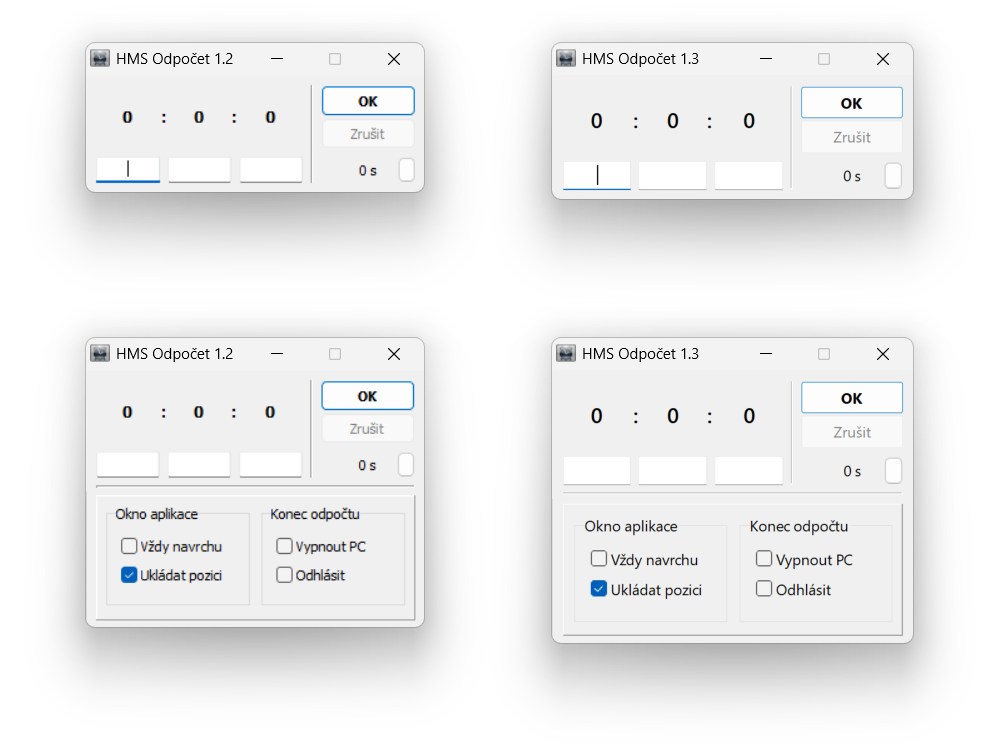

Aplikace v průběhu 15 let přeci jen zastarala a z důvodu absence zdrojových kódů není možné
např. i jen pouhé překompilování v současné verze Embarcadero Delphi 12.

A tak byl v roce 2025 původní spustitelné binárce dopřán drobný facelift za pomoci nástrojů
a metod reverzního inženýrství :-)...

Dále přidán skript.bat, který při spuštění aplikace nastaví proměnnou prostředí
__COMPAT_LAYER na "GdiDPIScaling DPIUnaware" pro zajištění lepšího škálování na soudobých
monitorech s vysokým rozlišením a DPI (proměnná prostředí odpovídá ručnímu zapnutí High DPI
scalling override: System (Enhanced) v dialogu Vlastnosti souboru - Kompatibilita.

#### Soubory
- **varianta 1.3b** je pokus o zapnutí lepšího vektorového DPI škálování (správně funguje jen u konkrétních
konfigurací&nbsp;&ndash;&nbsp;např. zvětšení nastavené na 125 % apod.)
- skript **HMS_Odpocet_1.3.bat** slouží pro spuštění v módu GDI škálování&nbsp;&ndash;&nbsp;obdobně možno ručně
přes Vlastnosti souboru–Kompatibilita: zde High DPI scalling override na System Enhanced)

### Souhrn úprav/patchů (+ použité nástroje):

- Heaventools PE Explorer 1.99 R6
  (https://www.heaventools.com/overview.htm)

  - Header Info - změna Time Date Stamp z 2010-04-04 13:45:23 -> 2025-03-08 19:03:03
  - Manifest - drobné úpravy
  - Version - upravené info o souboru a verzi aplikace
  - RC Data:
    - změna písma prvků formuláře Tahoma -> Segoe UI
    - změna písma ciferníku (Label1 až Label5) Tahoma -> Segoe UI Semibold, Font.Height -12 -> -16
    - lepší přichytávání k okrajům obrazovky: Form1.SnapBuffer 5 -> 10 (výchozí v IDE Delphi 12)
    - změna Hintu tlačítka OK: "Spustí odpočet" -> "Spustit odpočet"
    - změna Form1.ClientHeight z 208 -> 220 (i když nemá význam, protože ve řešeno fci. Form1Create)

- HxD Hex Editor 2.5.0.0
  (https://mh-nexus.de/en)

  - změna čísla verze aplikace (zobrazováno v titulku okna aplikace) - offset 0xB6350
  - úprava textu v dialogu O aplikaci (easter egg) - offset 0x6556

- Hex-Rays IDA Free 9.1.250226
  (https://hex-rays.com/ida-free)

  - úprava barev ciferníku (Label1-Label5) při odpočtu:
    - zaškrtnutý CheckBox Vypnout PC: 0x80 -> 0x8B (clWebDarkRed - tmavě červená)
      [fce: _TForm1_ChckBx_VypPCClick],
    - zaškrtnuté CheckBox Odhlásit:   0x80 -> 0x1E69D2 (clWebChocolate - tmavě oranžová)
      [fce: _TForm1_ChckBx_LogOutClick].
  - změna programově nastavované velikosti okna (tlačítko "Nastavení") kvůli ořezávání prvků při DPI škálování:
    - fce. [_TForm1_Timer2Timer] na offsetu [4B7FA0]
       - instrukce [cmp   eax, 0D0h] na offsetu [B73B6] porovnává aktuální velikost okna s konstantou 208,
         po stisknutí tlačítka "Nastavení" se zvětšování formuláře zastaví po dosažení této výšky (v px).
         Ručně přepsána hodnota 0xD0 (208) -> 0xDC (220) v hexaeditoru.
       - instrukce [cmp   eax, 5Eh] na offsetu [B7419] zajišťuje obdobně skrytí (zmenšení okna) Nastavení.
         Změněno z hodnoty 0x5E (94) -> na 0x64 (tj. 100 px).
    - fce [_TForm1_FormCreate] na offsetu [4B6D0C]
      - instrukce [mov   edx, 5Eh] na offsetu [B6126] zajišťuje nastavení velikosti okna aplikace po spuštění,
        rovněž upraveno z 0x5E -> 0x64.

### NEVYŘEŠENÉ (neřešené) PROBLÉMY:

Načítání a ukládání inicializačního souboru hms_odpocet.ini. Aplikace má snahu jej uložit do složky Windows,
k níž ovšem nemá přístup, pakliže neběží s oprávněními správce (automatické vyžádání řešitelné v Manifestu,
ale nadbytečné). Např. pro přípravu instalátoru (Inno Setup apod.) by bylo velmi vhodné,
kdyby aplikace ukládala soubor INI do adresáře, kde se nachází binárka spuštěného procesu.
